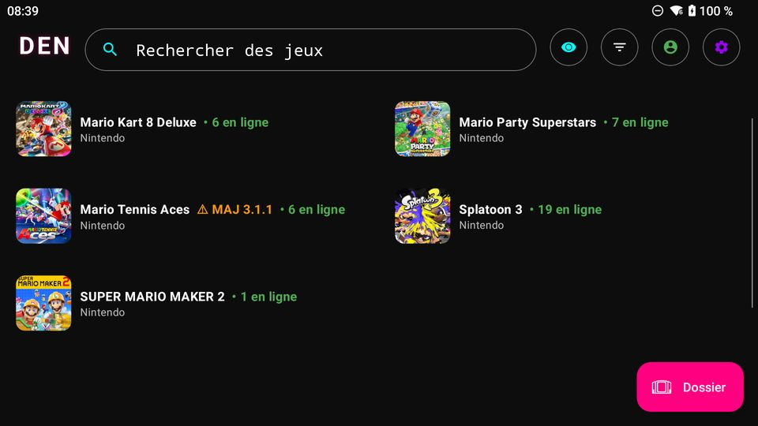
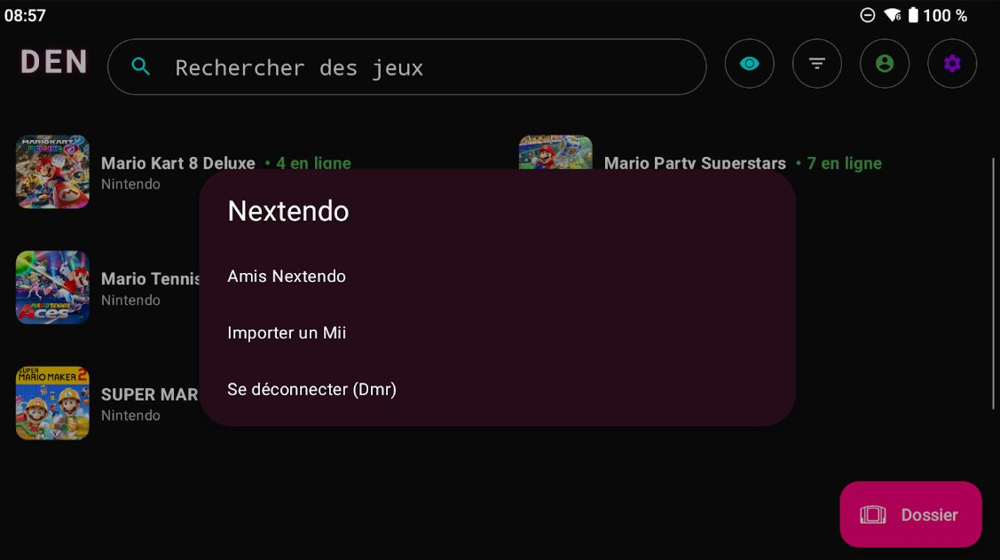
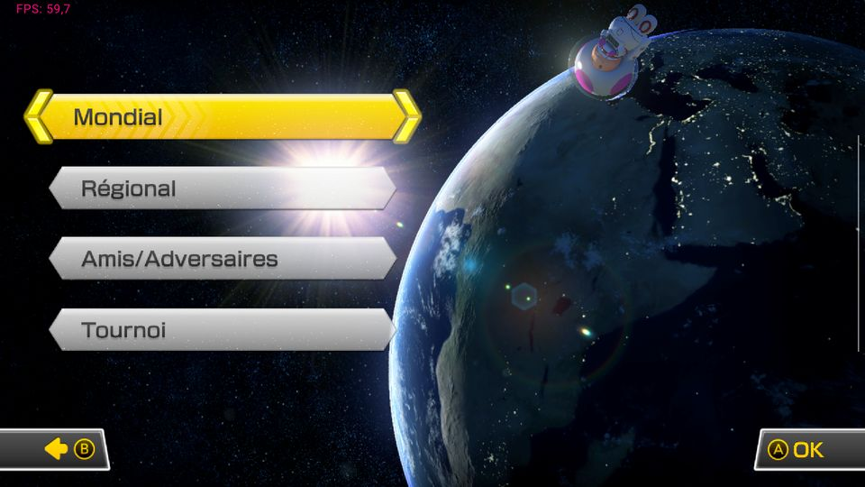
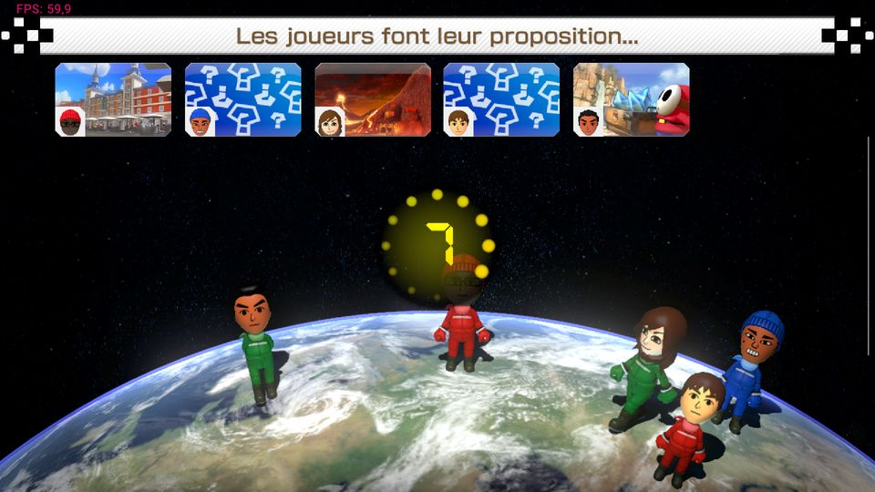
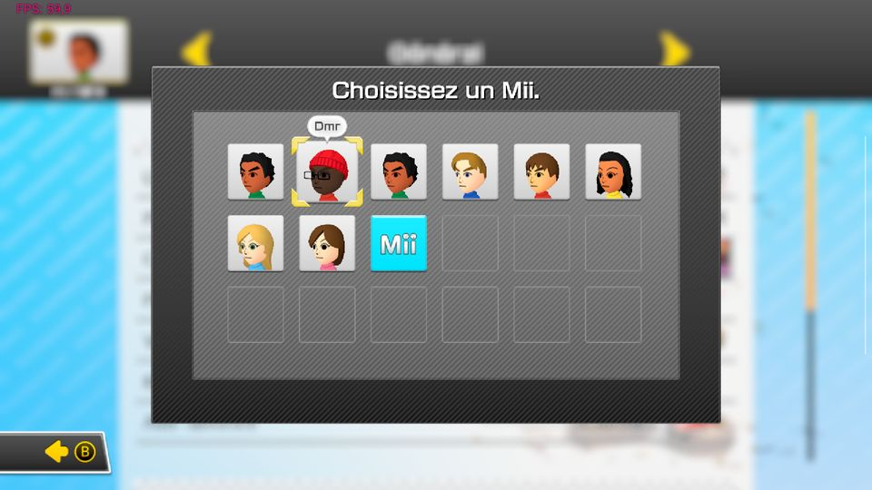
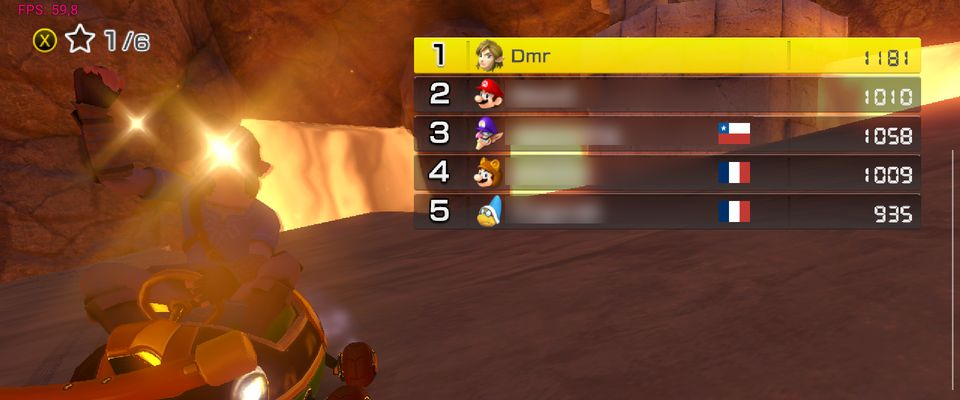

# DEN — Eden + Nextendo

**🇫🇷 Français** · [🇬🇧 English below](#-english)

DEN est un fork de l'émulateur Switch **[Eden](https://git.eden-emu.dev/eden-emu/eden)** pour **Android**, adapté pour se connecter à **Nextendo**, un réseau de jeu en ligne alternatif pour la Switch.

> Projet personnel et non officiel. Il n'est affilié ni à l'équipe d'Eden, ni à Citron, ni à Nextendo, ni à Nintendo.

<table>
<tr><td align="center" width="50%"> Liste des jeux : joueurs en ligne et badge de mise à jour</td><td align="center" width="50%"> Menu Nextendo : amis, import de Mii, compte</td></tr>
<tr><td align="center" width="50%"> Mario Kart 8 Deluxe : mode en ligne</td><td align="center" width="50%"> Salon en ligne avec d'autres joueurs</td></tr>
<tr><td align="center" width="50%"> Mii importé dans le jeu</td><td align="center" width="50%"> Course en ligne à 60 FPS</td></tr>
</table>

## 🔑 Prérequis : un compte Nextendo

Pour jouer en ligne avec DEN, il te faut un **compte Nextendo gratuit**, à créer sur **[nextendo.network](https://nextendo.network)**. Sans compte, DEN fonctionne comme un émulateur Switch classique, mais ni le jeu en ligne ni la liste d'amis ne sont disponibles.

1. Crée ton compte sur [nextendo.network](https://nextendo.network) et **confirme ton adresse e-mail**.
2. Dans DEN, ouvre le menu Nextendo et choisis **« Se connecter à Nextendo »** : la connexion se fait dans ton navigateur, DEN ne voit jamais ton mot de passe.
3. Tu ne peux être en ligne que sur **un seul appareil à la fois** avec le même compte.

<!-- DEN_ACCOUNT_REQ -->

## ✅ Ce qui fonctionne

- **Jeu en ligne sur Nextendo** : Mario Kart 8 Deluxe (salons et courses, stable dans nos tests), Super Mario Maker 2. Mario Party Superstars a été testé brièvement.
- **Amis Nextendo** : ta liste d'amis est visible dans les jeux. Un écran « Amis Nextendo » (bouton dans l'en-tête de la liste des jeux) montre qui est en ligne ou hors ligne.
- **Compteur de joueurs en ligne** affiché en vert sur chaque jeu compatible.
- **Badge orange « MAJ x.y.z »** quand ta version du jeu n'est pas celle que Nextendo exige (17 jeux de la liste Nextendo).
- **Import de Mii** (menu de la liste des jeux) : fichiers `.charinfo` / `.mii` et `MiiDatabase.dat` de Ryujinx.
- **Connexion à ton compte via le navigateur** (menu « Se connecter à Nextendo ») : récupère ton identité, tes amis et ta présence.

## ⚠️ Ce qui ne fonctionne pas (encore)

- **Jouer en ligne après « Se connecter à Nextendo »** : le serveur de jeu refuse pour l'instant le jeton de ce nouveau mode de connexion (erreur **2306-0802**). Pour jouer en ligne, tu dois placer ton fichier `nextendo_account.txt` (obtenu avec un autre client Nextendo, par exemple Citron) dans le dossier `Android/data/dev.eden.eden_emulator.relWithDebInfo/files/config/`. Nous avons demandé à Nextendo de corriger ça.
- **Splatoon 3** : le jeu se lance mais a des problèmes graphiques (en cours de correction).
- **Stabilité** : testé uniquement sur **Retroid Pocket 5**. Un appareil en surcadençage ou qui chauffe peut avoir des chutes de FPS et des déconnexions.
- Le nom du jeu auquel joue un ami peut s'afficher sous forme de code pour certains titres.

## Installation

**Configuration requise : Android 13 minimum, appareil 64 bits (arm64).** Testé sur Retroid Pocket 5.

1. Télécharge **`DEN.apk`** dans l'onglet [Releases](../../releases) et installe-le (autorise les sources inconnues).
2. Ajoute **tes propres** jeux, clés et firmware, obtenus légalement depuis ta console. Ce dépôt ne distribue ni jeux, ni clés, ni firmware.
3. Place ton `nextendo_account.txt` dans `files/config/` (voir ci-dessus) et lance un jeu compatible.

> 🔒 **Ne partage jamais ton `nextendo_account.txt`** : il contient un jeton qui donne accès à ton compte, comme un mot de passe.

## Compiler soi-même

Lance le workflow GitHub Actions **Build Android** (onglet *Actions*). L'APK sort dans l'artefact **DEN**.

## Crédits et licence

- **[Eden](https://git.eden-emu.dev/eden-emu/eden)** : l'émulateur de base (README d'origine : [README.eden.md](./README.eden.md)).
- **Citron** : inspiration pour certaines parties du support Nextendo.
- **yuzu** : le projet dont Eden est issu.

Licence **GPL-3.0 ou ultérieure** (voir [LICENSE.txt](./LICENSE.txt)). Les mentions de copyright des fichiers d'origine sont conservées.

---

# 🇬🇧 English

DEN is a fork of the **[Eden](https://git.eden-emu.dev/eden-emu/eden)** Switch emulator for **Android**, adapted to connect to **Nextendo**, an alternative online gaming network for the Switch.

> Personal, unofficial project. Not affiliated with the Eden team, Citron, Nextendo or Nintendo.

<table>
<tr><td align="center" width="50%"> Games list: online players and update badge</td><td align="center" width="50%"> Nextendo menu: friends, Mii import, account</td></tr>
<tr><td align="center" width="50%"> Mario Kart 8 Deluxe: online mode</td><td align="center" width="50%"> Online lobby with other players</td></tr>
<tr><td align="center" width="50%"> Imported Mii in game</td><td align="center" width="50%"> Online race at 60 FPS</td></tr>
</table>

## 🔑 Requirement: a Nextendo account

To play online with DEN you need a **free Nextendo account**, created at **[nextendo.network](https://nextendo.network)**. Without an account DEN works as a regular Switch emulator, but online play and the friends list are not available.

1. Create your account at [nextendo.network](https://nextendo.network) and **confirm your e-mail address**.
2. In DEN, open the Nextendo menu and choose **"Sign in to Nextendo"**: the sign-in happens in your browser, DEN never sees your password.
3. You can only be online on **one device at a time** with the same account.

## ✅ What works

- **Online play on Nextendo**: Mario Kart 8 Deluxe (lobbies and races, stable in our tests), Super Mario Maker 2. Mario Party Superstars was briefly tested.
- **Nextendo friends**: your friend list is visible in games. A "Nextendo Friends" screen (button in the games list header) shows who is online or offline.
- **Online player counter** shown in green on each compatible game.
- **Orange "UPDATE x.y.z" badge** when your game version is not the one Nextendo requires (17 games on Nextendo's list).
- **Mii import** (games list menu): `.charinfo` / `.mii` files and Ryujinx `MiiDatabase.dat`.
- **Sign in through your browser** ("Sign in to Nextendo" menu): fetches your identity, friends and presence.

## ⚠️ What doesn't work (yet)

- **Playing online after "Sign in to Nextendo"**: the game server currently rejects the token from this new sign-in method (error **2306-0802**). To play online, put your `nextendo_account.txt` (obtained with another Nextendo client, e.g. Citron) in `Android/data/dev.eden.eden_emulator.relWithDebInfo/files/config/`. We have asked Nextendo to fix this.
- **Splatoon 3**: the game launches but has graphical issues (being worked on).
- **Stability**: tested only on a **Retroid Pocket 5**. An overclocked or overheating device may see FPS drops and disconnections.
- The name of the game a friend is playing may show as a code for some titles.

## Install

**Requirements: Android 13 or newer, 64-bit (arm64) device.** Tested on a Retroid Pocket 5.

1. Download **`DEN.apk`** from the [Releases](../../releases) tab and install it (allow unknown sources).
2. Add **your own** games, keys and firmware, legally dumped from your console. This repository does not distribute games, keys or firmware.
3. Put your `nextendo_account.txt` in `files/config/` (see above) and launch a compatible game.

> 🔒 **Never share your `nextendo_account.txt`**: it contains a token that gives access to your account, like a password.

## Build it yourself

Run the **Build Android** GitHub Actions workflow (*Actions* tab). The APK comes out in the **DEN** artifact.

## Credits and license

- **[Eden](https://git.eden-emu.dev/eden-emu/eden)**: the base emulator (original README: [README.eden.md](./README.eden.md)).
- **Citron**: inspiration for parts of the Nextendo support.
- **yuzu**: the project Eden descends from.

Licensed under **GPL-3.0 or later** (see [LICENSE.txt](./LICENSE.txt)). Original copyright notices are preserved.
